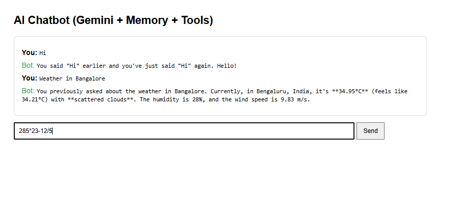
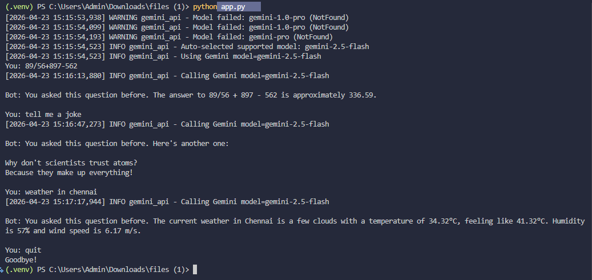

# AI Chatbot (Gemini) with Memory + Real‑Time Tools (Bitcoin, Weather)

A beginner-friendly but production-style Python chatbot that:
- Uses **Google Gemini API** to generate responses
- Remembers **conversation history (memory)**
- Fetches **real-time data**:
  - Bitcoin price (CoinGecko – no key needed)
  - Weather (OpenWeatherMap – API key needed)
- Works in **Terminal (CLI)** and **Browser (Flask Web UI)**

---

## Screenshots

### Browser UI


### Terminal CLI


---

## Features
- ✅ Gemini AI chat responses (`google-generativeai`)
- ✅ Conversation memory (remembers previous messages)
- ✅ Intelligent routing:
  - “bitcoin / price / crypto” → Bitcoin tool
  - “weather …” → Weather tool
  - otherwise → Gemini normal chat
- ✅ Clean modular structure
- ✅ CLI + Flask Web UI
- ✅ Logging for debugging

---

## Project Structure
```text
ai-gemini-chatbot/
│── app.py
│── web_app.py
│── requirements.txt
│── .env
│── README.md
│
├── chatbot/
│   ├── gemini_api.py
│   ├── memory.py
│   ├── router.py
│   ├── tools.py
│   └── prompts.py
│
├── utils/
│   ├── api_clients.py
│   └── logger.py
│
└── templates/
    └── index.html
```

---

# ✅ How to Clone & Run (Step-by-Step)

## 1) Clone the repository
```bash
git clone https://github.com/yashwanthr12/ai-gemini-chatbot.git
cd ai-gemini-chatbot
```
---

## 2) Create & activate virtual environment

### Windows (PowerShell)
```powershell
python -m venv .venv
.venv\Scripts\Activate.ps1
```

### macOS / Linux
```bash
python -m venv .venv
source .venv/bin/activate
```

---

## 3) Install dependencies
```bash
pip install -r requirements.txt
```

---

## 4) Create `.env` file (IMPORTANT)
In the project root, create a file named `.env`:

```env
# Gemini API Key (Google AI Studio)
GEMINI_API_KEY=YOUR_GEMINI_KEY_HERE

# OpenWeatherMap API Key (for weather tool)
OPENWEATHER_API_KEY=YOUR_OPENWEATHER_KEY_HERE

# Optional (you can change)
MODEL_NAME=gemini-2.5-flash
MEMORY_MAX_TURNS=20
LOG_LEVEL=INFO
```

### Where to get keys?
**Gemini key**
1. Open Google AI Studio
2. Create an API key
3. Paste it into `.env`

**OpenWeather key**
1. Create account on OpenWeatherMap
2. Generate API key
3. Paste it into `.env`

> Note: New OpenWeather keys may take 5–15 minutes to activate.

---

# ✅ Run the Chatbot

## Option A: Run in Terminal (CLI)
```bash
python app.py
```

Try:
- `Hello`
- `My name is Yashwanth`
- `What did I ask before?`
- `What is Bitcoin price?`
- `Weather in Bangalore`

Exit:
```text
exit
```

---

## Option B: Run in Browser (Flask UI)
```bash
python web_app.py
```

Open in browser:
```text
http://127.0.0.1:5000
```

---

## Common Errors (Quick Fix)

### 1) Gemini quota exceeded (429)
Free-tier limit reached. Fix:
- Wait a few seconds and try again
- Avoid repeated refresh/click spam in browser
- Use a different model if available
- Upgrade quota/billing if needed

### 2) Weather tool Unauthorized (401)
Your OpenWeather key is invalid or not active yet. Fix:
- Check `OPENWEATHER_API_KEY` in `.env`
- Restart app after updating `.env`
- Wait 5–15 minutes if key is new

---

## Future Improvements (Good for Interviews)
- Save memory in SQLite / Redis (persistent chat)
- Add user login + sessions for multi-user chat
- Add more tools (news, stocks, currency)
- Add streaming responses from Gemini
- Dockerize and deploy online

---

## Contributing
Contributions are welcome.

If you want to contribute:
1. Fork the repository
2. Create a new branch:
   ```bash
   git checkout -b feature/your-feature-name
   ```
3. Commit your changes:
   ```bash
   git commit -m "Add: your message here"
   ```
4. Push to your fork:
   ```bash
   git push origin feature/your-feature-name
   ```
5. Open a Pull Request

---

## Author
**Yashwanth**  
BCA Final Year Student | Python Backend | AI Tools & Prompt Engineering